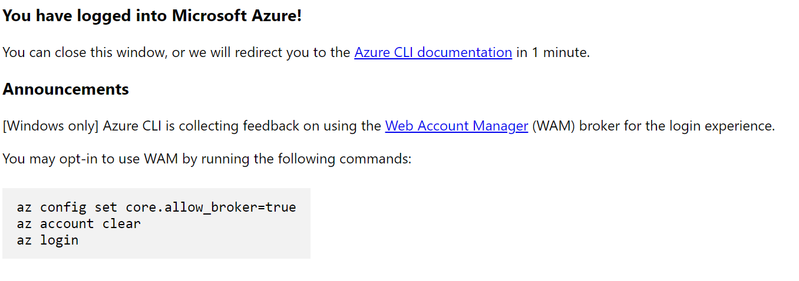
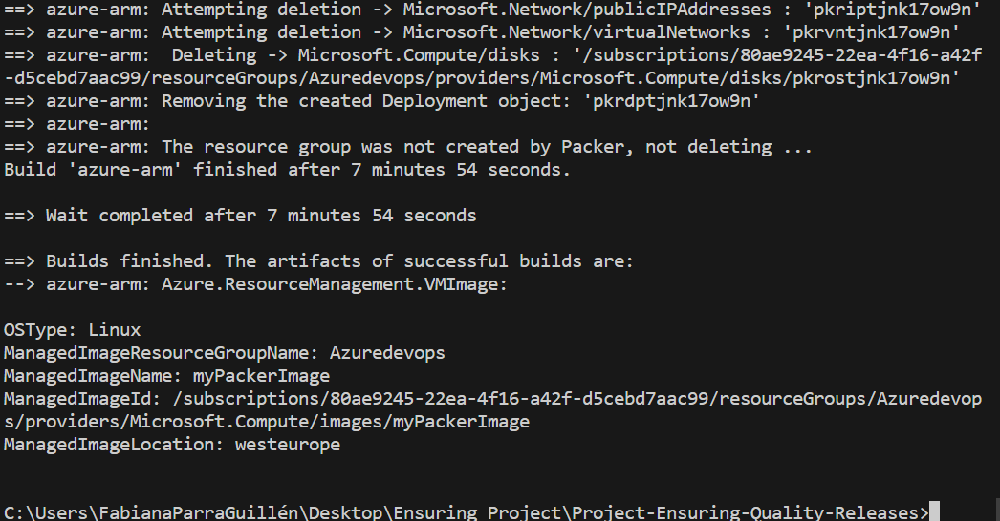
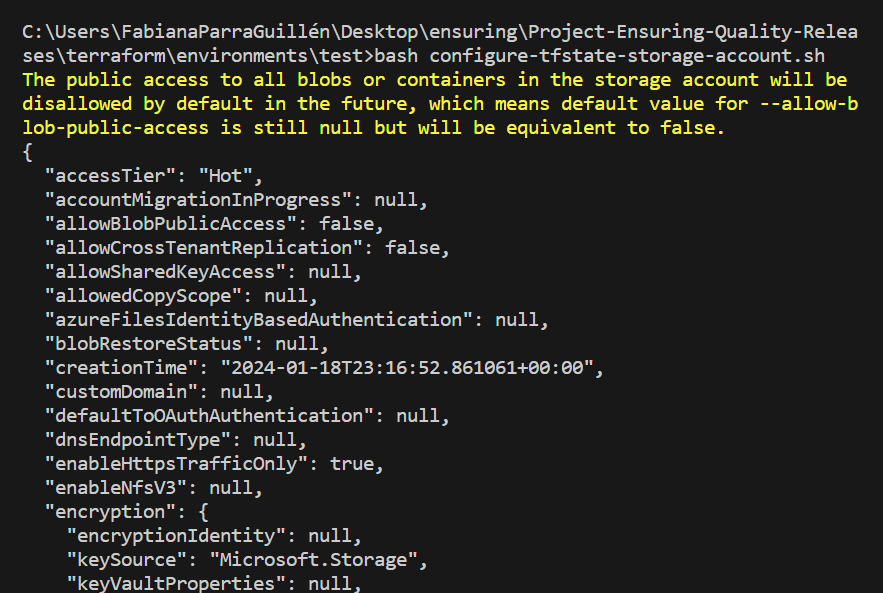
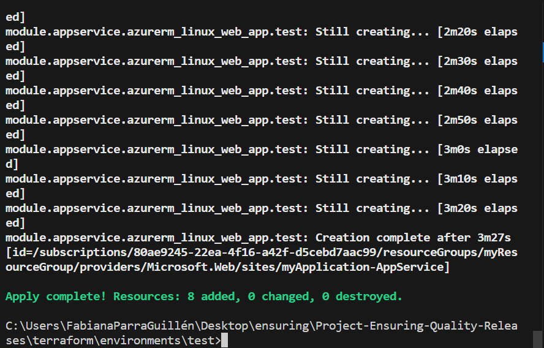

# Project Starter
This repository contains the starter code for the **Ensuring Quality Releases** project of the cd1807 Ensuring Quality Releases (Quality Assurance) course taught by Nathan Anderson. 


## How to use?
- Fork this repository to your Github account and clone it locally for further development. 
- Follow the classroom instructions, and check the rubric before a submission.

## Dependencies 

These are the following dependencies and softwares that the user must have in order to complete this project:

- Azure CLI
- Terraform
- JMeter
- Postman
- Python
- Selenium
- Chromedriver
- Chrome

## Instructions 
These are the step by step process followed to complete this project: 

1. Log in to your Azure account. This can be achieved through your preferred terminal, such as the Command Prompt (cmd). Utilize the following command to log in:

```
az login 
```



2. Within this repository, we are utilizing Azure credentials provided by Udacity. Consequently, the Azure resource group "Azuredevops" is employed. Execute the Packer image for the virtual machine.

To begin, update the variables specified in the "packer-image.json" file. Replace the placeholder values with your actual information for:

- Subscription ID
- Tenant ID
- Client ID
- Client Secret
- Resource Group Name
- Image Name
- VM Size

```
    "subscription_id": "",
    "tenant_id": "",
    "client_id": "",
    "client_secret": "",   
    "resource_group_name": "",
    "image_name": "",
    "vm_size": ""
```

Once this is done, run the following command to create a packer image: 
```
packer build ./packer-image.json
```


3. Next, configure the storage account and state backend. Initially, run the script named "create-tf-storage.sh" using the following command:

```
bash configure-tfstate-storage-account.sh
```


4. Then, replace the values in the "terraform/main.tf" file with the output obtained from running the "create-tf-storage.sh" script. Update the backend configuration in the "terraform.tfvars" file.


Generate SSH keys in the Azure command shell using the commands:

```
ssh-keygen -t rsa
cat ~/.ssh/id_rsa.pub

```
Place the generated keys in "terraform/modules/vm/vm.tf" under the "admin_ssh_key" section.

5. Run Terraform

Use the following commands: 

```
terraform init
terraform validate
terraform apply
```
Your results should look somewhat like this




### Pipeline Development:

1. Create a new project.
2. Generate a Personal Access Token (PAT) and retain it for later use.
3. Establish a new service connection.
4. Create an agent pool with access to all pipelines and add this agent to a virtual machine.
5. Create an environment and assign it to a different virtual machine than the one used in the previous step.
6. Finally, create a new pipeline by selecting the GitHub repository, and for the YAML configuration, choose "azure-pipelines.yaml."

Update the Terraform variables with those created in the preceding steps.
```
variables:
  python.version: ''
  azureServiceConnectionId: ''
  projectRoot: $(System.DefaultWorkingDirectory)
  environmentName: ''
  tfstatenumber: '' 
  tfrg: ''
  application_type: ''  
```
The pipeline consists of the following steps:

- Build the FakeRestAPI artifact by archiving the entire FakeRestAPI directory into a zip file.
- Deploy the FakeRestAPI to the Azure App Service created by Terraform.


## Automated testing

### Automated testing includes:

- Integration testing using Postman with data validation and regression tests.
- Performance testing using JMeter with stress and endurance tests.
- Functional UI testing using Selenium.

#### Postman 
- Data Validation Test


- Regression Test


#### JMeter Performance Testing 
- Stress Test


Report 


- Endurance Test


Report 


#### Functional Testing with Selenium 


Example of the Pipeline execusion 


### Monitoring and Observability
- Go to Azure Pipelines and go to the observability monitor, create a new alert. Execute the pipeline to trigger the alert.

#### Picture of the Monitor Chart 


#### Picture of the email alert


- Configure azure log analytics by downloading the selenium-test.log artifact from Azure Devops
- Navigate to the Azure Portal and access Azure Log Analytics workspaces.
- Configure an agent on the virtual machine in order to run the Slenium tests. Make sure the VM is connected tp capture the necessary logs. 
- Navigate to the Logs section and initiate the creation of a custom log.
- Specify the path of the selenium-test.log from the VM where the task was executed as the collection path for logs.

#### Custom Logs 
- Go to the logs section in the general group part of your logs analytics and select and run your custom log. 
